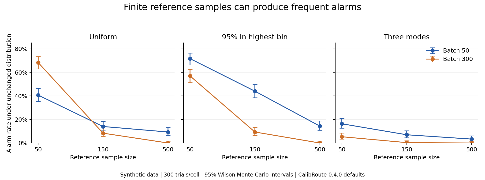
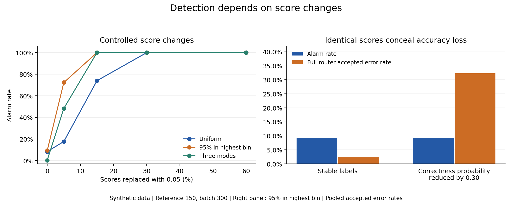

# Finite-reference shift-monitoring study

This is a synthetic evaluation of the **released 0.4.0 gate**, including its
unchanged 0.02 effect floor and 500 calibration resamples. The protocol was
committed as [14544f1](https://github.com/Garyouki/calibroute/commit/14544f1)
before the full simulation. No historical FIN or FiNER-ORD data were used.

## Main findings

**Small empirical reference sets can produce frequent alarms even when the
generating score distribution is unchanged.** For a batch of 300:

| Known synthetic distribution | Reference 50 | Reference 150 | Reference 500 |
|---|---:|---:|---:|
| Uniform across 10 bins | 68.3% | 8.3% | 0.0% |
| 95% in the highest bin | 57.0% | 9.3% | 0.0% |
| Three modes | 5.3% | 0.3% | 0.0% |

These are alarm proportions over 300 independent reference/batch draws per
cell. Zero observed alarms has a 95% Wilson upper endpoint of about 1.3%; it is
not proof of zero future alarms. At batch size 50, the high-confidence profile
still alarmed on 14.3% of trials with reference size 500. More reference data
alone does not establish a universal operating guarantee.

The known-population diagnostic compares batches with the true generating
histogram, using the same calibration and floor. Its alarm rate was 0/300 in
all the batch-300 stable cells. The contrast supports investigating uncertainty
in estimated reference histograms. The diagnostic is not a deployable correction
and does not show that simply substituting a larger threshold is appropriate.

**The monitor detects score changes, including changes that preserve correctness,
and cannot detect correctness changes that preserve scores.** With reference
150 and batch 300, replacing 15% of scores with 0.05 triggered 74% of uniform
trials and 100% of high-confidence and three-mode trials. The paired benign
30% replacement kept every correctness label identical to the stable trial;
all trials nevertheless alarmed because their score distributions changed.
Those are real score shifts, not false positives under the unchanged-score null.

For the high-confidence profile, the label-only scenario increased full-router
accepted error rate from **2.31% to 32.32%**, while alarm rate remained exactly
**9.3%**, with identical decisions on each paired trial.

## Routing cost

Three preset rules are compared: fixed 0.90 with all lower scores reviewed;
accept 0.80 / review 0.60 without the gate; and that same 0.80 / 0.60 rule with
the released gate. They are diagnostic presets, not policies fitted to satisfy
a claimed risk bound. Using the same instance thresholds with and without the
gate isolates the gate's contribution.

For the stable high-confidence profile at reference 150 / batch 300:

| Rule | Auto coverage | Accepted error rate | Review rate | Abstention rate |
|---|---:|---:|---:|---:|
| Fixed 0.90 | 94.87% | 2.25% | 5.13% | 0.00% |
| Threshold-only 0.80 / 0.60 | 95.42% | 2.28% | 1.18% | 3.40% |
| Full router | 86.59% | 2.31% | 10.37% | 3.04% |

Across 90,000 synthetic records, the gate added **8,270 review recommendations**
and withheld **162 errors** that the threshold-only rule would have accepted.
It did not improve the observed accepted error rate in this cell. Extra review
counts include previously abstained rows; the fixed baseline and threshold-only
rule have different abstention behavior. Withholding an error does not show a
human corrected it, and review counts are not measured labor time or savings.

See [all tables](reference/report.md) and [machine-readable results](reference/results.json)
for every cell, including accepted counts, errors, abstentions, and intervals.

## Reproduce

From the repository root, create a virtual environment and install
`calibroute-ai==0.4.0`. Example scripts are obtained from GitHub, not the wheel.
The simulation itself has no extra dependencies.

On Windows, run `.\.venv\Scripts\python.exe -I examples/shift_study/run_study.py --output examples/output/shift_study --workers 4`.
On macOS/Linux, use `./.venv/bin/python` in place of `.\.venv\Scripts\python.exe`.

The output directory must be empty. Outputs include the copied protocol,
10,800 trial-scenario records, a JSON summary, and Markdown tables. These cover
5,400 independent reference/batch draws; scenarios are paired within the three
150/300 cells. Each stable cell and each scenario cell contains 300 trials.
The summary records package/script/protocol/trial hashes and environment paths;
the checked-in summary omits local paths. Source files use LF for stable hashes.

For a small CLI check, add `--replications 2` and use a different output folder.
Overrides are explicitly labeled `smoke` and must not replace the full results.
The supplied protocol fixes seed 20260927 and derives separate deterministic
streams for references, batch scores, replacement masks, and correctness labels.
Worker count does not affect these streams.

Optional figures use matplotlib; they were rendered with version 3.10.8 in a
separate plotting environment. After installing matplotlib there, run
`python examples/shift_study/plot_results.py --input examples/output/shift_study/results.json --output examples/output/shift_study/figures`.
The plotting script emits PNG and SVG files. The simulation does not import it.

## Decision and limits

The results support **prioritizing calibration that accounts for both reference
and batch sampling uncertainty**, followed by a separately specified evaluation.
This study does not select a new numerical floor or change package defaults.
The existing [statistical scope](../../docs/design.md#statistical-scope) already
documents that empirical-reference calibration has no distribution-free
false-alarm guarantee; this experiment quantifies examples of that limitation.

- Correctness labels follow predefined synthetic laws. These are not deployment results.
- Routing thresholds were fixed before evaluation; no labels were used to fit them.
- Alarm intervals describe Monte Carlo uncertainty, not deployment risk, and are not simultaneous.
- Results average over newly sampled references. They do not establish conditional performance for one long-lived reference.
- The 0.02 floor, histogram sparsity, reference size, and batch size interact; alarm rates are not guaranteed to vary monotonically with batch size.
- Confidence monitoring needs labeled quality checks to detect the label-only failure mode.
- Historical FIN's alarm cannot be labeled a false positive from these simulations.
- No external user, production workflow, or human-review outcome was measured.
